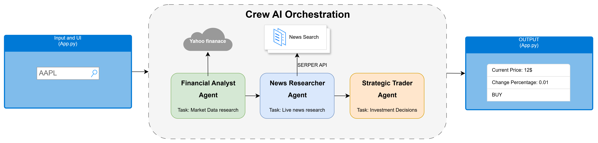

# Multi-Agent Stock Analysis with CrewAI

A powerful multi-agent AI system that performs intelligent stock analysis and trading recommendations using CrewAI framework and Groq LLM.

## 🎯 Features

- **Multi-Agent Analysis**: Financial Analyst and Strategic Trader agents work together
- **Real-time Stock Data**: Fetches live market data using Yahoo Finance
- **Trading Recommendations**: Get Buy/Sell/Hold recommendations based on market analysis
- **Command-Line Interface**: Analyze single or multiple stocks via CLI
- **Streamlit Dashboard**: User-friendly web interface for stock analysis
- **Batch Processing**: Analyze multiple stocks from a file
- **Results Export**: Save analysis results in TXT or JSON format

## 🎯 How it works



## 🏗️ Project Structure

```
market-insights-crew/
├─ main.py              # CLI entry point
├─ app.py               # Streamlit web dashboard
├─ crew.py              # CrewAI crew configuration
├─ requirements.txt     # Python dependencies
├─ .env                 # Environment variables (API keys)
├─ agents/
│  ├─ analyst_agent.py       # Financial analyst agent
|  ├─ news_agent.py          # News Researcher agent
│  └─ trader_agent.py        # Trading decision agent
├─ tasks/
│  ├─ analyze_task.py        # Stock analysis task
│  ├─ news_task.py           # News research task
│  └─ trader_task.py         # Trading decision task
└─ tools/
   └─ stock_research.py      # Stock research tools
```

## 🚀 Getting Started

### Prerequisites

- Python 3.10+
- Groq API Key

### Installation

1. **Clone the repository**

```bash
cd multi-agents-with-crewai
```

2. **Create virtual environment**

```bash
python -m venv venv
venv\Scripts\activate
```

3. **Install dependencies**

```bash
pip install -r requirements.txt
```

4. **Set up environment variables**

Create a `.env` file in the project root:

```
GROQ_API_KEY=your_groq_api_key
SERPER_API_KEY=your_serper_api_key
```

## 💻 Usage

### Command-Line Interface

**Analyze a single stock:**

```bash
python main.py --stock AAPL
python main.py -s TSLA
```

**Analyze multiple stocks:**

```bash
python main.py --stocks AAPL MSFT GOOGL TSLA
python main.py -m AAPL NVDA
```

**Analyze stocks from a file:**

```bash
python main.py --file stocks.txt
```

**Save results to file:**

```bash
# Save as text
python main.py --stocks AAPL MSFT --output results.txt

# Save as JSON
python main.py --stocks AAPL TSLA NVDA --output results.json
```

**Get help:**

```bash
python main.py --help
```

### Streamlit Dashboard

Launch the interactive web dashboard:

```bash
streamlit run app.py
```

Then:

1. Open your browser to `http://localhost:8501`
2. Enter a stock ticker (e.g., AAPL)
3. Click "Run Analysis"
4. View results in structured bullet-list format
5. Expand "Raw Output" to see detailed analysis

## 📊 Sample Stocks File

Create `stocks.txt` with one ticker per line:

```
AAPL
MSFT
GOOGL
TSLA
NVDA
```

Then run:

```bash
python main.py --file stocks.txt --output analysis.json
```

## 🤖 Agents

### Financial Analyst Agent

- Role: Analyzes stock performance and market data
- Analyzes current price, daily changes, volume, and volatility
- Produces detailed market observations

### Strategic Stock Trader Agent

- Role: Makes trading decisions based on analysis
- Provides Buy/Sell/Hold recommendations
- Justifies recommendations with technical signals and risk assessment

## 📈 Output Format

### Analysis Results Include:

- **Summary**: Overview of stock performance
- **Current Stock Price**: Live market price
- **Daily Price Change & Percentage**: Price movement
- **Volume & Volatility**: Trading activity metrics
- **Trading Recommendation**: Buy/Sell/Hold decision
- **Justification**: Reasoning behind the recommendation

### Export Formats:

- **TXT**: Human-readable format with sections
- **JSON**: Structured data format for programmatic use

## 🛠️ Configuration

Edit `crew.py` to customize:

- Agent roles and goals
- Task descriptions
- Tool parameters
- LLM model settings

## 📋 Requirements

Core dependencies:

- `crewai` - Multi-agent framework
- `groq` - LLM API client
- `streamlit` - Web dashboard
- `python-dotenv` - Environment variable management
- `yfinance` - Stock data (via tools)

## 🔄 Workflow

1. **Input**: User provides stock ticker(s)
2. **Analysis**: Financial Analyst agent fetches and analyzes data
3. **News**: News Agents fetches live news
4. **Decision**: Trader agent makes recommendations
5. **Output**: Results displayed or saved to file

## 📝 Example Output

```
Analyzing: AAPL
============================================================

- Summary: Stock showing moderate trading activity with slight decline
- Current stock price: $260.33 USD
- Daily price change and percentage: -2.03 (-0.78%)
- Volume and volatility: 23,411,003 shares traded

Trading Recommendation: HOLD

Justification: Minor daily change indicates stability. Monitor for
significant changes in price, volume, or technical indicators before
making buy or sell decisions.
```

## 🐛 Troubleshooting

**"Error: File not found"**

- Ensure the stocks.txt file exists in the project root
- Check file path is correct

**"API Error"**

- Verify API keys are correct in `.env`
- Check internet connection
- Ensure API keys have sufficient quota

**"Module not found"**

- Reinstall dependencies: `pip install -r requirements.txt`
- Activate virtual environment

## 🚦 Next Steps

- Add more technical indicators
- Build portfolio optimization features
- Create performance tracking dashboard
- Add email/Slack notifications
